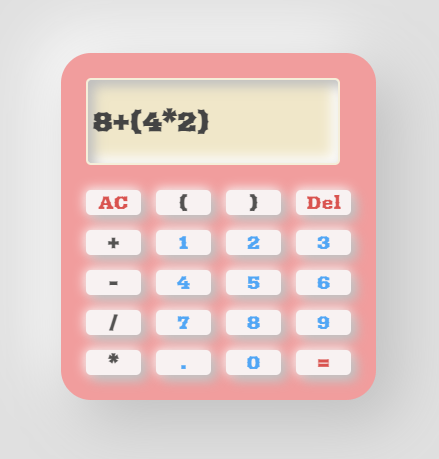

Fancy Calculator

A stylish and interactive web-based calculator featuring a fancy design with a sliding effect. This project shows CSS techniques, DOM manipulation, and expression evaluation in JavaScript.

Tech Stack

-HTML5: Structure

-CSS3: Advanced layouts

-JavaScript: Dynamic DOM updates, error handling, and expression parsing.

-Google Fonts: "Arbutus" font for a unique look.

Live Demo

You can try the calculator live here:  
[**https://berkeikikarakayali.github.io/fancy-calculator/**](https://berkeikikarakayali.github.io/fancy-calculator/)

  

